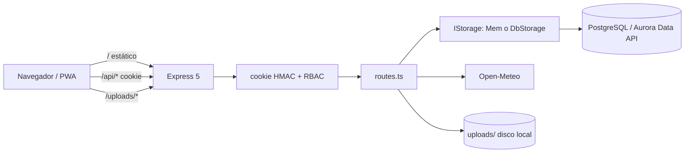
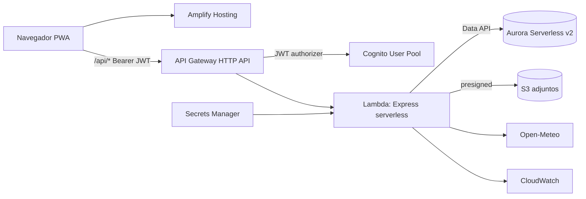

# AGROSBO - Arquitectura actual y objetivo

Separa inequívocamente la implementación actual, el objetivo del hackathon y la
visión futura. Basado en auditoría del código.

## Current implementation (as-is)

- **Frontend**: React 18 + Vite 5 + TypeScript; React Router 6; React Query 5;
  Tailwind + shadcn/radix; Dexie (IndexedDB); PWA (service worker + manifest).
  API por rutas relativas `/api/*` (mismo origen), `credentials: "include"`.
- **Backend**: Express 5 modular monolith (`api/src/routes.ts`); adaptador Lambda
  presente (`api/src/handlers/index.ts`, `@vendia/serverless-express`), no
  desplegado.
- **Datos**: PostgreSQL vía Drizzle. `api/src/db.ts` usa RDS Data API si
  `AWS_RDS_*`, o node-postgres si `DATABASE_URL`. `MemStorage` cubre solo el core
  del `IStorage` (dev).
- **Auth**: cookie firmada HMAC + RBAC (5 roles); `AUTH_ENFORCEMENT` on/off.
- **Servicios**: Open-Meteo (clima), alertas derivadas, reportes CSV en servidor,
  adjuntos en disco local, mapa SVG/GeoJSON propio, idempotencia HTTP persistente.
- **Infra**: `infra/` placeholder (sin CDK real).

## Hackathon target architecture

- **Frontend**: **AWS Amplify Hosting** (despliegues por rama; API URL
  configurable; no depende de cookies same-origin). CloudFront separado solo si
  se demuestra una necesidad específica.
- **API**: API Gateway HTTP API + Lambda (Express serverless), modular monolith.
- **Identidad**: **Amazon Cognito** User Pool + JWT authorizer; proveedor local
  solo para dev/tests (ADR 010).
- **Datos**: Aurora PostgreSQL Serverless v2 + RDS Data API; Drizzle; migraciones
  reproducibles.
- **Archivos**: S3 + URLs prefirmadas; metadata en PostgreSQL.
- **Seguridad**: Cognito JWT en staging/prod; proveedor local en dev; Secrets
  Manager; RBAC en PostgreSQL.
- **Operación**: CloudWatch; CDK; ambientes reproducibles.
- **Diferenciadores aprobados**: Bedrock (copiloto, Spec #13); Textract o Azure
  DI (extracción documental, benchmark ADR 013).

## Long-term platform architecture (evolución, NO implementada)

- Multi-tenancy real (organizations/farms/memberships).
- Amazon Cognito (identidad gestionada).
- Marketplace y órdenes; solicitudes de servicio y órdenes de trabajo.
- Mensajería y notificaciones (candidatos: WebSocket, SES, SQS).
- EventBridge Scheduler para tareas periódicas.
- Copiloto con Bedrock (tool calling, solo lectura primero).
- Auditoría avanzada.

## Diferencias current → target

| Área | Current | Target |
|---|---|---|
| Hosting web | express.static | S3 + CloudFront |
| Cómputo API | Express local/adapter | Lambda tras API Gateway |
| DB acceso | pg o Data API | Aurora SV2 + Data API |
| Adjuntos | disco local | S3 + presigned |
| Secretos | env local | Secrets Manager |
| Observabilidad | logs stdout | CloudWatch |
| IaC | placeholder | CDK |

## Bloqueadores para el target

1. Migrar adjuntos de disco local a S3 (ADR 007).
2. Aislar el import de Vite en `api/src/index.ts` (import dinámico) para el bundle
   Lambda.
3. Servir frontend y API en el mismo origen (cookies + URLs relativas).
4. Definir el stack CDK (hoy placeholder).
