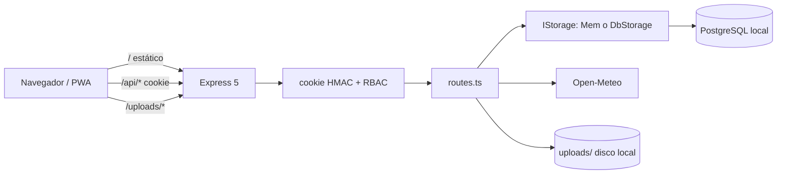
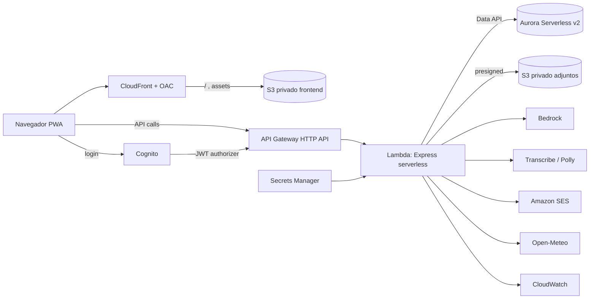

# AGROSBO - Arquitectura actual y objetivo

Separa inequívocamente la implementación actual, el objetivo del hackathon y la
visión futura. Basado en auditoría del código.

## Current implementation (as-is)

- **Frontend**: React 18 + Vite 5 + TypeScript; React Router 6; React Query 5;
  Tailwind + shadcn/radix; Dexie (IndexedDB); PWA (service worker + manifest).
  API por rutas relativas `/api/*` (mismo origen), `credentials: "include"`.
- **Backend**: Express 5 modular monolith (`api/src/routes.ts`); adaptador Lambda
  presente (`api/src/handlers/index.ts`, `@vendia/serverless-express`), no
  desplegado.
- **Datos**: PostgreSQL vía Drizzle. `api/src/db.ts` usa RDS Data API si
  `AWS_RDS_*`, o node-postgres si `DATABASE_URL`. `MemStorage` cubre solo el core
  del `IStorage` (dev).
- **Auth**: cookie firmada HMAC + RBAC (5 roles); `AUTH_ENFORCEMENT` on/off.
- **Servicios**: Open-Meteo (clima), alertas derivadas, reportes CSV en servidor,
  adjuntos en disco local, mapa SVG/GeoJSON propio, idempotencia HTTP persistente.
- **Infra**: `infra/` placeholder (sin CDK real).

> Nota: el camino RDS Data API existe parcialmente en código (`db.ts`); no fue
> probado contra Aurora real; no está desplegado. En el flujo CURRENT verificado,
> solo se usa PostgreSQL local vía node-postgres.

## Hackathon target architecture (PLANNED P0, no desplegado)

- **Frontend**: S3 privado + **CloudFront** con Origin Access Control (OAC).
  La topología exacta (CloudFront como proxy de /api/* vs URL separada con CORS)
  se decidirá en la Spec de infraestructura. Amplify Hosting fue evaluado y
  descartado (ADR 016).
- **API**: API Gateway HTTP API + Lambda (Express serverless), modular monolith.
- **Identidad**: **Amazon Cognito** User Pool + JWT authorizer; proveedor local
  solo para dev/tests (ADR 010).
- **Datos**: Aurora PostgreSQL Serverless v2 + RDS Data API; Drizzle; migraciones
  reproducibles.
- **Archivos**: S3 privado + URLs prefirmadas; metadata en PostgreSQL.
- **Agente**: Bedrock con tool calling; Transcribe STT; Polly TTS; herramientas
  estructuradas; confirmación antes de mutaciones (ADR 015).
- **Colaboradores**: token opaco; SES; estados honestos (ADR 017).
- **Inteligencia**: evaluación visual preliminar Bedrock multimodal;
  IrrigationDelayScenario determinista (ADR 018).
- **Seguridad**: Cognito JWT en staging/prod; proveedor local en dev; Secrets
  Manager; RBAC; auditoría minimizada.
- **Operación**: CloudWatch; CDK; ambientes reproducibles.

> Nota: la topología CloudFront/API (enrutar /api/* via CF vs URL separada) sigue
> sin decidirse. Data API existe parcialmente en código pero no fue verificado
> contra Aurora real. Lambda adapter existe en código pero no fue verificado en
> AWS. Ningún recurso está desplegado.

## Long-term platform architecture (P2, no implementada)

- Multi-tenancy real (organizations/farms/memberships).
- Marketplace y órdenes comerciales autónomas.
- Mensajería en tiempo real (WebSocket).
- WhatsApp Cloud API.
- Pagos, reputación, logística.
- Automatización financiera/contractual avanzada.
- Diagnóstico agronómico especializado.

> Nota: el agente operacional multimodal (con mutaciones confirmadas) es P0, no
> P2. Ver [`./operational-agent-plan.md`](./operational-agent-plan.md).

## Diferencias current → target

| Área | Current | Target P0 |
|---|---|---|
| Hosting web | express.static | S3 privado + CloudFront + OAC |
| Cómputo API | Express local/adapter | Lambda tras API Gateway HTTP API |
| DB acceso | pg o Data API (parcial) | Aurora SV2 + Data API |
| Adjuntos | disco local | S3 privado + presigned |
| Secretos | env local | Secrets Manager |
| Observabilidad | logs stdout | CloudWatch |
| IaC | placeholder | CDK |
| Identidad | cookie HMAC local | Cognito JWT |
| Agente | ausente | Bedrock + herramientas + confirmación |
| Voz | ausente | Transcribe + Polly |
| Notificaciones | ausente | SES |
| Visión | ausente | Bedrock multimodal |

## Prerequisitos para el target

1. Migrar adjuntos de disco local a S3 (Spec 20).
2. Definir en Spec 18/19 la topología CloudFront/API: validar URL configurable y
   CORS si se usan orígenes separados; validar autenticación Cognito JWT. No se
   decide aquí el routing /api/*.
3. Definir el stack CDK (Spec 18).

### Prerequisito ya cerrado

- Aislar el import de Vite en `api/src/index.ts`: resuelto. `app.ts` no importa
  Vite; `server.ts` maneja dev; `handlers/index.ts` importa `app.ts`
  directamente.
